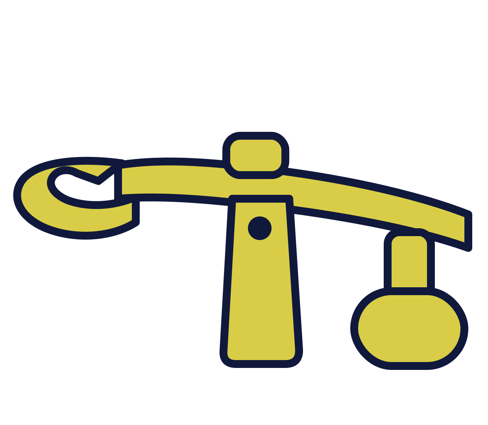

# monjolo

[](LICENSE)
[](https://www.rust-lang.org/)

<p align="center">
  
</p>

**Monjolo is a deterministic runtime for continuous dynamic process simulation.**

It runs dynamic models as living processes: a simulation loop that integrates state over time (RK4), components exchanging signals by name (`DynamicModel`/`StateRegistry`), first-order sensor/actuator blocks, and an I/O boundary (`IoImage`) designed to expose those signals to industrial protocols — today an optional OPC-UA adapter (`opcua` feature), with room for others in the future. It is general-purpose: it knows nothing about Tennessee Eastman, chemistry, or any specific plant.

---

## The name

A *monjolo* is a rustic hydraulic machine for husking/grinding grain, driven continuously by the force of water — a distinctive symbol of rural Brazilian culture, despite its Asian origin. The metaphor is direct: this crate is the mechanism that turns on its own, tick after tick, driven by numerical integration — and whatever you want to "grind" (a reactor, a pendulum, a tank network) fits into it without the mechanism itself needing to know what it's processing.

---

## Origin

This crate was born inside [`tep-plant`](https://github.com/Green-Cinnamon-Labs/tep-plant), the lab's Rust simulator for the Tennessee Eastman Process (TEP) — itself a fork of [`camaramm/tennessee-eastman-profBraatz`](https://github.com/camaramm/tennessee-eastman-profBraatz), the reference FORTRAN implementation of the Downs & Vogel (1993) model.

During the refactor of `tep-plant` to expose the plant via OPC-UA (see `spec-tennessee-eastman`, issues #55/#57), it became clear that a large part of the code had nothing to do with Tennessee Eastman: state management, numerical integration (RK4), first-order valve/actuator dynamics, disturbance generation, initial-condition loading, thread lifecycle (plant + adapter) — all of that was generic, reusable by any simulated plant. Only the chemistry, thermodynamics, and subsystem topology (reactor, separator, stripper, compressor) were actually TEP-specific.

Separating these two things had two motivations:

- **Pedagogical**: other students can build their own dynamic models on top of `monjolo` without needing to understand or rewrite the simulation machinery — they just implement `DynamicModel` for whatever is specific to their problem.
- **Organizational**: the separation of concerns made `tep-plant` itself easier to understand and evolve, and made it clearer where each improvement (a new integrator, a new adapter, a new sensor type) actually belongs.

---

## What it is / what it isn't

**It is:**
- A way to compose dynamic models (`DynamicModel`) into a tree, each reading/writing its own state by semantic name.
- A numerical integrator (RK4) decoupled from everything else — it just sums state vectors from a `dynamics` closure.
- Generic reusable blocks: 1st-order actuator (`Valve`, `Agitator`), sensor with pluggable behavior (`Ideal`, `Noisy`, `Hysteresis`), C¹-continuous cubic disturbance channel.
- A supervised runtime (`Simulation`) that runs the plant and, optionally, a network adapter (today only OPC-UA) on separate threads.

**It is not:**
- A Tennessee Eastman simulator — that's `tep-plant`, which consumes this crate.
- A control framework — there's no notion of controller/loop here; that's the responsibility of whoever builds the model (or of a supervisory repository, like `tep-operator`).

---

## Core concepts

### `DynamicModel` / `CompositeDynamicModel`

Central interface: `evaluate()` recomputes a component's values/derivatives by reading/writing through `Proxy`s it already holds since subscription — never via a string lookup on the hot path. `CompositeDynamicModel` is the supertrait for anything orchestrating others: `add_dynamic()` only orders the evaluation sequence; each child component is the one declaring its own slots when it subscribes to the `StateRegistry`.

Leaf components (e.g. `Valve`) do not implement `CompositeDynamicModel` — trying to compose them is a compile-time error, not a runtime one.

### Structural limit: DAG, not DAE

`CompositeDynamicModel::evaluate_children()` runs each child **exactly once**, in fixed insertion order — only correct if the dependency graph between components is a DAG. If two components need each other's value at the same instant (an algebraic cycle — strong coupling, e.g. a hydraulic network with implicit pressure-flow relations), a single pass doesn't close and the result is **silently** wrong, with no panic. Closing that would require an iterative solver (Newton/tearing) inside the evaluation phase — it doesn't exist today; this is a structural limitation of the framework, not of TEP. The place reserved for this already has a name: `Interator` (`numerical_method/interator.rs`), the algebraic-dimension counterpart to `Integrator` — today just an empty trait (`fn name()`), with no implementation nor a settled `step()` signature; the discussion of how to implement it (candidate: Newton-Raphson) is left for later.

### `StateRegistry`, `Proxy`, `ReadProxy`

Holds two distinct buffers:
- `EvaluationState` — working copy for one evaluation round, may contain hypothetical values (RK4 sub-steps). Addressed by `Proxy`.
- `CurrentState` — the last confirmed state. Addressed only by `ReadProxy` (read-only, never hypothetical), used by `Sensor`.

`subscribe(offers, needs)` reserves slots and returns `Proxy`s; positions are append-only and resolved **exactly once** — after that, reading/writing is direct indexing into a `Vec<Cell<f64>>`, no hashing. `commit()` copies `EvaluationState → CurrentState` at the end of each tick.

### `NumericalMethod` / `Integrator`

Closed enum (today only `RK4`) — only the framework decides which methods exist, so `Simulation` can't be handed an arbitrary integrator from outside. The `Integrator` knows nothing about `Proxy`/`DynamicModel`: it receives a state vector and a `dynamics: &[f64] -> Vec<f64>` closure, and returns the next state.

### Generic blocks

- **`actuator::dynamic`** — `Valve`/`Agitator`: 1st-order lag, `d(position)/dt = (command - position) / τ`.
- **`sensor::model`** — `Sensor` reads `CurrentState` via `ReadProxy` and applies a pluggable `SensorBehavior`: `Ideal` (no transformation), `Noisy` (Gaussian noise), `Hysteresis` (dead band).
- **`disturbance::cubic`** — `DisturbanceChannel`: piecewise cubic polynomial, continuously regenerated, with C¹ continuity (value and derivative) at the joints — produces a smooth random signal.
- **`snapshot`** — `Snapshot::from_file` flattens any TOML file into `"dotted.path" -> f64`, without knowing what each key means; each component fetches only the keys it cares about during its own construction.

### `Simulation`

A builder until `run()` is called (`set_model`, `set_adapter`, `add_sensor`, `add_actuator` only store definitions). `run()` spawns up to two supervised threads — the "plant thread" and the "adapter thread" — which only communicate via `SnapshotBus` (read) and `CommandQueue` (write), never directly through `StateRegistry` (which isn't `Send`). Each thread reports exactly one `ServiceEvent` (`Stopped`/`Failed`/`Panicked`, the latter via `catch_unwind`) before exiting; `run()` returns as soon as the first one dies.

### Adapters (`opcua` feature)

`AdapterConfig` is also a closed enum — today only `OpcUa { endpoint }`. It spins up an OPC-UA server (via `async-opcua` + `tokio`, on its own runtime created inside the adapter thread) exposing each declared sensor/actuator as a node. `opcua`/`tokio` are optional dependencies, gated behind the `opcua` feature: the framework's core doesn't pay that cost unless it needs networking.

---

## Usage

```rust
use monjolo::adapter::AdapterConfig;
use monjolo::dynamic_model::DynamicModel;
use monjolo::numerical_method::NumericalMethod;
use monjolo::simulation::Simulation;
use monjolo::state_registry::{Proxy, StateRegistry};

// A minimal DynamicModel: exponential decay dv/dt = -v.
struct Decay {
    value: Proxy,
    derivative: Proxy,
}

impl Decay {
    fn new(registry: &mut StateRegistry) -> Self {
        let (offered, _) = registry.subscribe(&["decay.value", "decay.value.derivative"], &[]);
        offered[0].set(100.0);
        Self { value: offered[0].clone(), derivative: offered[1].clone() }
    }
}

impl DynamicModel for Decay {
    fn evaluate(&self) {
        self.derivative.set(-self.value.get());
    }

    fn state_keys(&self) -> Vec<String> {
        vec!["decay.value".to_string()]
    }
}

fn main() {
    let mut simulation = Simulation::new();
    simulation.set_model(Decay::new);
    simulation.set_numerical_method(NumericalMethod::RK4);
    simulation.set_adapter(AdapterConfig::OpcUa { endpoint: "opc.tcp://0.0.0.0:4840/demo/".into() });
    simulation.run().expect("run ended with an error");
}
```

For a richer, real-world example (composition of several subsystems, initial condition via `Snapshot`, sensors declared by the model itself), see how [`tep-plant`](https://github.com/Green-Cinnamon-Labs/tep-plant) (`composite` branch) implements `TennesseeEastmanModel` on top of this crate — `src/model.rs` and `src/bin/tep_plant.rs`.

---

## Cargo Features

| Feature | Default | What it enables |
|---|---|---|
| *(none)* | — | Core: `DynamicModel`, `StateRegistry`, `NumericalMethod`/RK4, actuator/sensor/disturbance, `Snapshot`, `IoImage`. Only depends on `rand`/`rand_distr`/`toml`. |
| `opcua` | off | Adds `adapter::opcua` — pulls in `async-opcua` + `tokio` (dependencies too heavy to be the default for a generic simulation framework). |

```bash
cargo build                  # core, no networking
cargo build --features opcua # with the OPC-UA adapter
cargo test --features opcua  # runs the whole unit test suite
```

---

## Current state / known limitations

- There's only one numerical method (`RK4`) and one adapter (`OpcUa`) — both are closed enums by design, so adding a new one is a change inside the crate itself, not an external extension.
- No cooperative cancellation: if the plant thread and the adapter thread are both running and one dies, the other isn't notified — it's up to whoever called `run()` to decide to end the process.
- No separate integration tests/examples yet — coverage today is only inline `#[cfg(test)]` in each module (12 tests in the core + `opcua` feature).
- No formal versioning/publishing yet (`0.1.0`, local dependency only).

---

## License

The code in this repository is licensed under [Apache-2.0](LICENSE). Third-party dependencies keep their own licenses — see [NOTICE.md](NOTICE.md).

To audit the licenses of the entire dependency graph (including transitive ones):

```bash
cargo install cargo-deny
cargo deny check licenses
```

Security vulnerabilities: see [SECURITY.md](SECURITY.md).

---

## Tests

```bash
cargo test --features opcua
```
