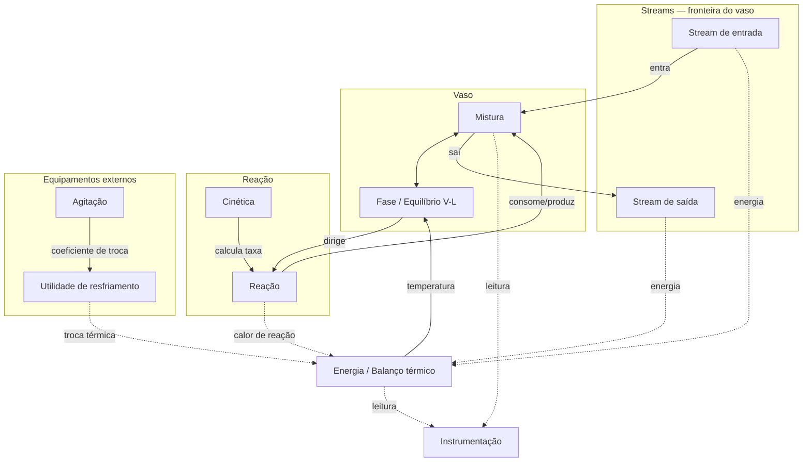

# Entidades conceituais do Reactor — visão de engenheiro químico, não de código

Este documento parte de uma pergunta diferente das anteriores desta pasta: em vez de "como o `struct Reactor` deveria ficar em Rust", a pergunta é "o que um engenheiro químico enxerga quando olha pra esse vaso" — sem se prender a nenhum campo, tipo ou atributo que já existe hoje no código real ou nos rascunhos hipotéticos. A lista abaixo é um catálogo de candidatas, não uma decisão de design; nenhuma delas está implementada e nenhuma é compromisso de que vai virar um tipo Rust.

Como pano de fundo físico: o Reactor é um vaso de volume fixo que recebe um stream de entrada (mistura vinda do compressor), mantém internamente uma mistura em duas fases (vapor e líquido) que reage entre si, troca calor com uma utilidade de resfriamento, é agitado mecanicamente, e descarrega um stream de saída pro separador. As entidades abaixo tentam nomear as peças distintas dentro dessa descrição.

- **Mistura** → o conteúdo químico dentro do vaso: elementos com propriedades diferentes, misturados no mesmo ambiente físico. Existe independente de fase — vapor e líquido não são dois objetos, são duas visões (ou dois estados) da MESMA mistura.

- **Fase / Equilíbrio vapor-líquido** → a mesma mistura se reparte entre vapor e líquido segundo uma relação de equilíbrio (pressão parcial de gás ideal pra uns componentes, Antoine pra outros, dependente de temperatura e pressão). É um conceito PRÓPRIO, distinto da mistura em si: a mistura é "o que existe ali dentro", a fase é "como isso se distribui entre dois estados físicos coexistentes, dado T e P".

- **Reação** → por causa das condições do ambiente (energia/temperatura, concentração/pressão parcial), os elementos se consomem e se produzem mutuamente — a composição da mistura muda ao longo do tempo por conta disso.

- **Cinética** → a REGRA que determina a velocidade da reação (expressões tipo Arrhenius, dependência de pressão parcial de componentes específicos) — diferente da Reação em si: cinética é a FUNÇÃO que calcula a taxa a partir do estado atual; Reação é o EFEITO (quanto de cada espécie é consumido ou produzido) resultante de aplicar essa função.

- **Streams (fluxo de entrada e de saída)** → matéria cruzando a fronteira do vaso. Um stream de entrada traz mistura de fora pra dentro, um de saída leva mistura de dentro pra fora. Um stream carrega vazão E composição junto — não é só um número, é uma mistura em movimento.

- **Vaso / Capacidade** → o volume físico do reator é fixo, mas se reparte dinamicamente entre o espaço ocupado pelo vapor e o espaço ocupado pelo líquido, dependendo de quanto líquido existe ali dentro num dado momento. É um conceito geométrico/de capacidade, distinto da mistura que ocupa esse espaço.

- **Energia / Balanço térmico** → o reator carrega um estado de energia (entalpia) paralelo ao estado de massa — entra energia pelos streams, sai pelos streams, entra por calor de reação, entra ou sai por troca térmica com a utilidade de resfriamento. A temperatura é uma CONSEQUÊNCIA desse balanço, não um estado independente por si só.

- **Utilidade de resfriamento** → a água que circula pela serpentina do reator é um sistema EXTERNO conectado ao vaso, não parte do processo químico principal — é uma espécie de "stream", mas de utilidade (não traz nem leva massa reagente), com sua própria vazão, temperatura de entrada/saída e lógica de troca térmica.

- **Agitação** → o agitador mecânico dentro do vaso é um equipamento cuja velocidade influencia a taxa de troca térmica (via um coeficiente de troca que depende da agitação). Não é química, não é mistura — é um efeito mecânico que interage com a física do vaso por fora da composição.

- **Instrumentação / Medição** → o que o reator torna OBSERVÁVEL pro resto da planta (pressão medida, nível medido, temperatura medida) é um subconjunto — às vezes uma transformação — do estado interno verdadeiro, não a mesma coisa que a grandeza física em si. Um sensor de pressão não É a pressão, é uma leitura dela.

## Como isso pode se relacionar

Vale notar, mesmo sem comprometer nada: Mistura e Fase parecem a base (tudo mais lê ou modifica isso); Reação e Cinética formam um par função/efeito; Streams são o que conecta essa Mistura ao resto da planta; Vaso é o palco físico onde tudo acontece; Energia é um segundo balanço paralelo ao de massa; Utilidade de resfriamento e Agitação são equipamentos externos que influenciam a Energia sem fazer parte da Mistura; Instrumentação é uma camada de leitura por cima de tudo isso, não uma entidade do processo em si.

## Diagrama

## Status

Registrado como brainstorm de domínio, não como design. Nenhuma dessas entidades tem tipo Rust associado — inclusive é possível que mais de uma vire o mesmo tipo, ou que uma dessas vire só um método de outra, dependendo de como a modelagem avançar. O objetivo aqui foi só nomear o que existe conceitualmente antes de decidir como isso se estrutura em código.
